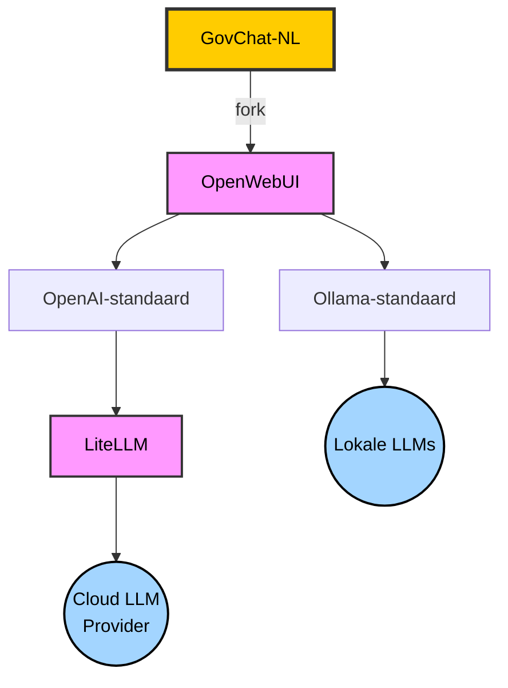

# GovChat-NL

Welkom bij de **GovChat-NL repository** ! 

Dit project is ontworpen voor Nederlandse **overheidsinstanties**, met als doel ondersteuning te bieden bij de implementatie van **AI-oplossingen**. Het platform faciliteert zowel **chatbots** als gespecialiseerde **AI-toepassingen**. Deze toepassingen zijn eenvoudig toegankelijk via een ingebouwde **App Launcher**. Met **GovChat-NL** kunnen organisaties een balans vinden tussen **centraal beheer** en **decentrale vrijheid**, waarbij gestandaardiseerde functionaliteiten gecombineerd worden met maatwerkopties. Het platform is volledig afgestemd op de eisen van overheidsorganisaties, onder andere op het gebied van **veiligheid**, **privacy** en **schaalbaarheid**. 

## Voordelen van GovChat-NL 

GovChat-NL biedt een breed scala aan voordelen die zijn afgestemd op de behoeften van Nederlandse overheidsinstanties:

- **Gebruiksklare oplossingen**  
  Het platform fungeert als een veilig alternatief voor openbare chatbots (zoals ChatGPT of DeepSeek) en dure commerciële oplossingen (zoals Copilot). GovChat-NL ondersteunt vrijwel iedere LLM-provider, waaronder **OpenAI**, **Ollama**, **Azure AI** en **Vertex AI**.

- **Specifieke AI-toepassingen voor de publieke sector**  
  Het platform bevat een **App Launcher** met applicaties die specifiek zijn ontworpen voor overheidstaken, zoals het vereenvoudiging van teksten naar **B1-taalniveau**, het geautomatiseerd beoordelen van **subsidieaanvragen**, en **audiotranscriptie**.

- **Geavanceerde beveiligingsopties**  
  Veiligheid staat centraal, met integratie van bestaande Identity and Access Management (IAM)-systemen zoals **OAuth2**, **Single Sign-On (SSO)** en **Microsoft Entra ID**. 

- **Aanpasbare en flexibele implementatie**  
  GovChat-NL is ontworpen om makkelijk te integreren binnen bestaande IT-omgevingen van overheidsorganisaties. Het platform is flexibel en kan op allerlei manier worden gehost, zowel op lokale servers als in cloudomgevingen. 

- **Beheer en controle**  
  Het beheer is eenvoudig via een admin paneel binnen GovChat-NL, waarmee gebruikersrollen, rechten en instellingen in enkele klikken te beheren zijn. Dit biedt organisaties volledige controle over de applicatie zonder complexe technische vereisten.

## App Launcher

De **App Launcher** is een centrale plek in het GovChat-NL platform waar de beschikbare AI-toepassingen eenvoudig toegankelijk zijn voor gebruikers. Via de App Launcher kunnen overheden AI-tools gebruiken die specifiek zijn afgestemd op hun behoeften, zoals vereenvoudiging van teksten, subsidiebeoordeling of automatische transcriptie.

Onderstaande tabel geeft een overzicht van de huidige en geplande apps in de App Launcher:

| **App**            | **Beschrijving**                                      | **Status**       | **Initiatiefnemer**       | **Meer informatie**         |
|---------------------|------------------------------------------------------|------------------|---------------------------|-----------------------------|
| **B1-Taalniveau**   | Vereenvoudigt teksten naar B1-taalniveau.            | Onder ontwikkeling | Provincie Limburg       | [Meer informatie](docs/app-launcher/b1-taalniveau.md) |
| **Subsidies**       | Beoordeelt subsidieaanvragen en genereert rapportages.| Onder ontwikkeling | Provincie Limburg      | [Meer informatie](docs/app-launcher/subsidies.md)     |
| **Transcriptie**    | Converteert audiobestanden naar tekst.               | Gepland          | -                         | Beschikbaar binnenkort     |

---

## Implementatie 

GovChat-NL wordt geleverd in twee vormen: 

1. **Volledige broncode**: Geschikt voor uitgebreide en onvoorziene aanpassingen en te vinden in deze repository. 
2. **Docker Images**: Beschikbaar via de packages-sectie van deze GitHub-repository. Deze zijn ideaal voor standaardimplementaties met uitsluitend voorziene aanpassingen. 

Organisaties hebben de keuze om GovChat-NL te implementeren op lokale servers of in een cloudomgeving. Deze flexibiliteit maakt het mogelijk om GovChat-NL volledig af te stemmen op de bestaande infrastructuur. 

### Specifieke Implementatie: Provincie Limburg 

Een praktijkvoorbeeld van GovChat-NL is de implementatie bij de **Provincie Limburg**, waarbij gebruik wordt gemaakt van een Docker Image gehost in Elestio. Taalmodellen worden gehost in Microsoft Azure en Google Vertex AI. Voor meer informatie over deze specifieke uitrol kunt u [deze pagina](/docs/implementaties/provincie-limburg.md) raadplegen. 

### Andere Deploymentmogelijkheden 

GovChat-NL biedt echter vele verschillende deploymentopties. Raadpleeg hiervoor de upstream documentatie. 

## Balans tussen Centraal en Decentraal 

GovChat-NL streeft naar een optimale balans tussen centraal beheer en decentrale vrijheid: 

- **Centraal**:  
   - Kernfunctionaliteiten en belangrijke updates worden centraal onderhouden. 
   - Ontwikkeling van nieuwe AI-toepassingen vindt centraal plaats. 

- **Decentraal**:  
   - Overheidsorganisaties kunnen thema's, data en functionaliteiten zelfstandig aanpassen via het admin paneel. 
   - Implementaties kunnen worden toegespitst op de eigen infrastructuur. 
   - Grote wijzigingen kunnen worden doorgevoerd in een kopie van de broncode. Optioneel kunnen deze wijzigingen via een pull request worden voorgesteld voor opname in de centraal beheerde code. 

## Onderliggende repositories 

GovChat-NL is ontwikkeld op basis van open-source technologieën: 

### [OpenWebUI](https://github.com/open-webui/open-webui):  

OpenWebUI vormt de basis van GovChat-NL en biedt een veelzijdige, schaalbare architectuur. Belangrijke kenmerken: 
- Uitgebreide chatbot-interface en deployment-opties. 
- Robuust framework voor authenticatie en admin-beheer. 
- Ondersteuning voor verschillende taalmodellen (lokaal of in de cloud via standaarden zoals Ollama en OpenAI). 

 

### [LiteLLM](https://github.com/BerriAI/litellm): 

LiteLLM biedt flexibele en schaalbare integratie van Large Language Models (LLM's) Deze module biedt: 
- Een uniforme interface voor het koppelen van LLM-providers. 
- Flexibiliteit om te schakelen tussen verschillende AI-modellen en leveranciers, zoals OpenAI, Anthropic en andere. 

## Documentatie 

GovChat-NL wordt geleverd met uitgebreide documentatie voor installatie, configuratie en beheer: 

- **Implementatiehandleiding**: Stapsgewijze uitleg voor het implementeren van GovChat-NL.  
- **Admin Paneel Handleiding**: Handleiding voor het beheren van gebruikers, instellingen en thema-aanpassingen 
- [**Thema-aanpassingen**](/docs/handleidingen/thema-aanpassingen.md): Gedetailleerde uitleg over hoe organisaties hun chatbot kunnen aanpassen aan specifieke huisstijlrichtlijnen 
- **Beveiligingsrichtlijnen**: Documentatie over de veiligheidsmaatregelen en aanbevelingen voor het waarborgen van privacy 
- **Authenticatieopties**: Uitleg over authenticatiemethoden, zoals SSO (Single Sign-On) en OAuth-integratie.

## Bijdragen 

We moedigen bijdragen aan deze repository aan. Raadpleeg CONTRIBUTING.md voor meer informatie over hoe je kunt bijdragen aan de ontwikkeling van GovChat-NL. 
