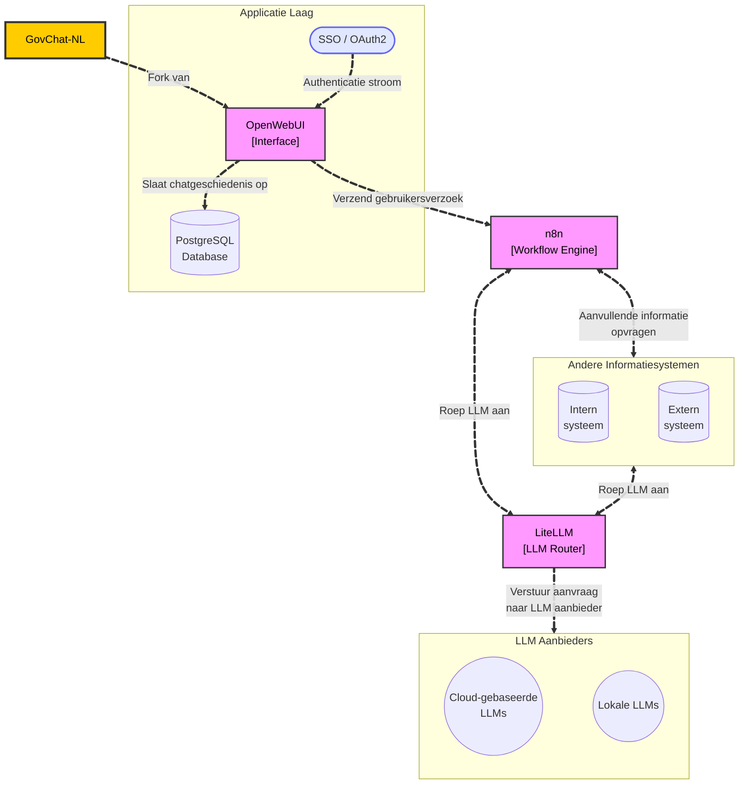

# GovChat-NL

GovChat-NL is een open-source platform voor en door Nederlandse overheidsorganisaties dat ondersteunt bij het implementeren en beheren van AI-oplossingen. Het platform stelt organisaties in staat om zowel chatbots als andere AI-toepassingen laagdrempelig in te zetten. Dankzij de ingebouwde App Launcher hebben gebruikers direct toegang tot relevante AI-tools, die zijn afgestemd op overheidstaken. Daarnaast voorziet het platform standaard in een uitgebreide handleiding gericht op AI-geletterdheid voor Nederlandse ambtenaren (zoals wettelijk verplicht vanuit de AI-verordening).

## Waarom GovChat-NL? 

GovChat-NL biedt verschillende voordelen voor Nederlandse overheidsorganisaties:

- **Gebruiksklare en sectorspecifieke AI-oplossingen**  
  Naast de bekende chatfunctionaliteit (vergelijkbaar met ChatGPT) biedt het platform via de ingebouwde App Launcher direct inzetbare AI-tools, specifiek voor overheidstaken, zoals het vereenvoudigen van teksten van willekeurige lengte naar B1-niveau met de Versimpelaar-app.

- **Ondersteuning voor AI-geletterdheid en regelgeving**  
  Het platform bevat een uitgebreide, standaard meegeleverde handleiding die specifiek is gericht op AI-geletterdheid voor ambtenaren, conform de wettelijke verplichtingen uit de AI-verordening (vanaf februari 2025).

- **In de praktijk getoetst (inclusief DPIA)**
  GovChat-NL wordt reeds gebruikt door verschillende overheden (700+ gebruikers) en beschikt over een goedgekeurde Data Protection Impact Assessment (DPIA) als referentie.

- **Geavanceerd beheermanagement per app (RBAC en taalmodellen)**  
  Binnen GovChat-NL zijn geavanceerde beheerfuncties toegevoegd waarmee je per applicatie in de App Launcher zowel de toegangsrechten (met Role-Based Access Control) als het gebruikte taalmodel kunt instellen. Zo kun je bijvoorbeeld bepalen dat alleen subsidieverleners toegang hebben tot apps zoals de ToeKenner (voor het beoordelen van subsidieaanvragen), terwijl de Versimpelaar juist breed toegankelijk blijft. Daarnaast kun je per app het gewenste taalmodel selecteren, zodat de belasting verspreid wordt over verschillende modellen.

- **Centrale basis, lokale flexibiliteit**  
  Het platform wordt centraal beheerd en onderhouden in deze repository, maar ondersteunt ook lokale aanpassingen en maatwerk.

- **Geavanceerde beveiliging en beheer**  
  Integratie met bestaande Identity and Access Management (IAM)-systemen (zoals OAuth2, SSO, Microsoft Entra ID) en uitgebreide beheermogelijkheden via een admin-paneel, inclusief Role-Based Access Control (RBAC).

- **Veiligheid, privacy en schaalbaarheid**  
  Ondersteunt belangrijke eisen op het gebied van informatiebeveiliging, privacy en schaalbaarheid.

- **Ondersteuning voor alle gangbare LLM-providers**  
  Flexibele koppeling met vrijwel alle grote leveranciers van Large Language Models (zoals OpenAI, Ollama, Azure AI en Vertex AI).

- **Flexibele implementatie en integratie**  
  Ondersteunt zowel lokale als cloudgebaseerde hosting en biedt diverse opties voor integratie binnen bestaande IT-infrastructuren.

## App Launcher

De **App Launcher** is het centrale startpunt binnen het GovChat-NL platform, waar gebruikers eenvoudig toegang krijgen tot beschikbare AI-toepassingen. Dankzij deze functie kunnen overheidsorganisaties snel gebruikmaken van diverse AI-tools die specifiek zijn ontwikkeld voor overheidstaken.

**Toegangscontrole per app (uitgebreidere RBAC)**
Bovenop de standaard Role-Based Access Control (RBAC) van OpenWebUI biedt GovChat-NL de mogelijkheid om per app in de App Launcher te bepalen wie toegang heeft tot welke applicatie of workflow. Zo kun je bijvoorbeeld instellen dat alleen subsidieverleners gebruik mogen maken van gevoelige toepassingen zoals de ToeKenner (voor subsidieaanvragen), terwijl de Versimpelaar juist voor alle medewerkers toegankelijk blijft. Dit bevordert informatiebeveiliging en zorgt ervoor dat medewerkers alleen toegang hebben tot relevante AI-tools.

**Beheer van taalmodellen per app**
Daarnaast is in GovChat-NL een extra beheermogelijkheid toegevoegd waarmee je per applicatie in de App Launcher het meest geschikte taalmodel kunt selecteren. Zo kun je voor iedere app een model kiezen dat past bij het beoogde gebruik, bijvoorbeeld een efficiënt en snel taalmodel voor de Versimpelaar en een krachtiger model voor juridische analyse-tools. Bovendien kun je de LLM-workload verdelen over verschillende modellen of providers. Hiermee voorkom je dat één model of leverancier overbelast raakt of zijn quota overschrijdt.

Via de App Launcher zijn momenteel de volgende AI-applicaties (of plannen daarvoor) beschikbaar:

| **App**            | **Beschrijving**                                      | **Status**       | **Initiatiefnemer**       | **Meer informatie**         |
|---------------------|------------------------------------------------------|------------------|---------------------------|-----------------------------|
| **Versimpelaar**   | Vereenvoudigt teksten naar B1- of B2 taalniveau.            | Beschikbaar | Provincie Limburg       | [Meer informatie](docs/app-launcher/versimpelaar.md) |
| **ToeKenner**       | Beoordeelt subsidieaanvragen en genereert rapportages.| In ontwikkeling | Provincie Limburg      | [Meer informatie](docs/app-launcher/subsidies.md)     |
| **WooAssist**    | Helpt bij het doorzoeken van je mails en bestanden bij een woo-verzoek.               | Backlog          | Provincie Limburg                         | Beschikbaar binnenkort     |

**Voorbeeld applicatie: de Versimpelaar**

---

## Implementatie 

GovChat-NL kan op verschillende manieren worden geïmplementeerd, zodat het platform aansluit op de wensen en infrastructuur van de organisatie. Er zijn daarbij twee hoofdkeuzes:

1. **Keuze van implementatievorm:**
   - **Docker-image**  
     - Gebruiksklaar en gemakkelijk te implementeren.
     - Ideaal bij standaardinrichtingen met beperkte aanpassingen.
     - Beschikbaar als package via deze GitHub-repository.
   - **Via broncode**  
     - Geschikt voor uitgebreide of onverwachte aanpassingen.
     - Volledige controle en flexibiliteit.
     - Beschikbaar in deze repository.

2. **Keuze van hostingomgeving:**
   - **Lokale servers**  
     - Volledige controle over data, infrastructuur en beveiliging binnen de eigen organisatie.
   - **Cloudomgeving**  
     - Schaalbaar, flexibel en doorgaans sneller of eenvoudiger te implementeren.

Deze twee keuzes kunnen naar wens worden gecombineerd. Zo kan GovChat-NL bijvoorbeeld als custom-implementatie draaien op lokale servers, of als Docker-image ingezet worden in de cloud. Zo blijft het platform flexibel en altijd af te stemmen op de bestaande IT-voorzieningen en eisen van de organisatie.

### Specifieke Implementatie: Provincie Limburg (incl. DPIA)

Een praktijkvoorbeeld van GovChat-NL is de implementatie door de **Provincie Limburg**. Hierbij wordt gebruikgemaakt van een Docker-image, gehost via Elestio op Hetzner-infrastructuur. De onderliggende taalmodellen draaien in Microsoft Azure (en Google Vertex AI).

Voor deze implementatie is een uitgebreide **Data Protection Impact Assessment (DPIA)** uitgevoerd. In de DPIA zijn de potentiële risico’s voor privacy en gegevensbescherming in kaart gebracht en zijn de genomen beheersmaatregelen beschreven. Deze DPIA is goedgekeurd en als referentie beschikbaar voor andere overheidsorganisaties die GovChat-NL willen inzetten.

- De volledige DPIA is [hier](/docs/implementaties/provincie-limburg-dpia.pdf) te raadplegen.
- Meer informatie over deze implementatie is te vinden op [deze pagina](/docs/implementaties/provincie-limburg.md).

## Onderliggende repositories

GovChat-NL maakt gebruik van diverse krachtige open-source technologieën. Hieronder volgt een overzicht van de belangrijkste componenten:

### [OpenWebUI](https://github.com/open-webui/open-webui)
OpenWebUI is een open-source chatinterface die de basis vormt van GovChat-NL. Belangrijke eigenschappen zijn:
- **Uitgebreide chatbot-interface** functionaliteit en gebruikerservaring vergelijkbaar met ChatGPT.
- **Ingebouwde authenticatie en beheermogelijkheden**, inclusief ondersteuning voor Role-Based Access Control (RBAC) voor het beheren van gebruikersrechten en -rollen.
- **Schaalbare architectuur** biedt diverse mogelijkheden voor uitrol, zowel lokaal als in de cloud.

### [n8n](https://github.com/n8n-io/n8n)
n8n is een open-source workflow automation platform waarmee processen en integraties tussen verschillende systemen eenvoudig te automatiseren zijn, zonder diepgaande programmeerkennis. Belangrijke kenmerken:
- **Automatisering van processen**: taken en acties kunnen automatisch worden uitgevoerd.
- **Visuele workflow-editor**: processen en koppelingen kunnen zonder programmeerkennis worden opgebouwd en beheerd.
- **Flexibele integraties**: honderden standaardkoppelingen (API’s) met veelgebruikte applicaties en databronnen zorgen voor maximale connectiviteit.

### [LiteLLM](https://github.com/BerriAI/litellm)
LiteLLM biedt een flexibele manier om Large Language Models (LLM’s) te integreren. Enkele voordelen:
- **Uniforme interface voor LLM-providers**, eenvoudige koppeling met vrijwel alle gangbare LLM’s.
- **Gebruik van meerdere aanbieders en modellen tegelijkertijd**, ondersteuning van o.a. Microsoft Azure, Google Vertex AI, Mistral en meer.
- **Monitoring en limietinstellingen** centraal beheer van gebruik, limieten en monitoring, bijvoorbeeld per model of team.

### Architectuuroverzicht
Onderstaande diagram laat de relatie en samenwerking tussen de verschillende repositories en systeemonderdelen visueel zien.

### Ontwikkelomgeving

GovChat-NL beschikt over een uitgebreide lokale ontwikkelomgeving. Dankzij hot-reloading worden wijzigingen in de broncode direct doorgevoerd, zonder dat de applicatie handmatig hoeft te worden herstart. Dit vergemakkelijkt en versnelt het ontwikkelproces.

Voor meer informatie over het opzetten van de ontwikkelomgeving, zie de [Developer Mode documentatie](docs/handleidingen/developer-mode.md).

### Bijdragen en overleg

Wil je bijdragen aan GovChat-NL? Je kunt je bijdrage indienen via een pull request (PR); je PR wordt geëvalueerd en bij geschiktheid toegevoegd aan het platform.

Daarnaast is er een tweewekelijks digitaal overleg met verschillende overheden, waaronder de provincies Overijssel, Flevoland, Utrecht en de Gemeente Meierijstad. Heb je interesse om deel te nemen of wil je meer informatie? Neem gerust contact met ons op, bijvoorbeeld via LinkedIn.
