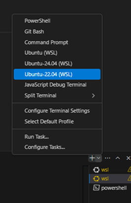
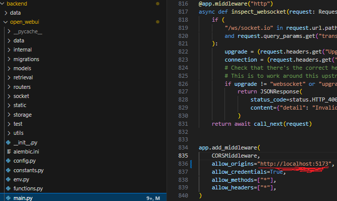

# GovChat-NL

Welkom bij de **GovChat-NL ontwikkel handleiding**

## Initiele installatie

- **0. Visual studio code met WSL-extensie**
  Gebruik VS Code om code te bewerken. 
  Installeer de "Remote Development"-extensie en het "WSL" Expansion Pack om WSL-projecten direct te openen.

- **1. Installatie van WSL**  
  Open PowerShell als Administrator.
  Voer het volgende commando uit om WSL2 te activeren:

  wsl --install

  Dit installeert WSL2 als standaard en downloadt Ubuntu (als je nog geen Linux-distributie hebt).

  Herstart je computer wanneer daarom wordt gevraagd.
  Controleer of de installatie correct is uitgevoerd:
  
  wsl --list --verbose
  
  Dit toont een lijst van geïnstalleerde distributies en de gebruikte versie (WSL2).

- **2. Configuratie van de Linux-omgeving**  
  Start je WSL-distributie (bijv. Ubuntu) via het Startmenu of door wsl in PowerShell/CMD te typen.
  Update de pakketlijst en installeer updates:

  sudo apt update && sudo apt upgrade -y

- **3. Installatie van Python**  
  Python is meestal al beschikbaar in de meeste WSL-distributies. Controleer dit met:

  python3 --version

  Als Python 3.11+ niet geïnstalleerd is:

  sudo apt install python3 python3-pip -y

- **4. Installatie van Conda**  
  Anaconda of Miniconda is een populaire tool voor het beheren van Python-pakketten. Miniconda is aanbevolen vanwege de compactere installatiegrootte.

  wget https://repo.anaconda.com/miniconda/Miniconda3-latest-Linux-x86_64.sh

  Volg de instructies op het scherm, accepteer de licentie en stel de standaardpaden in.
  Herstart de shell:

  source ~/.bashrc

  Controleer of Conda correct is geïnstalleerd:

  conda --version

## Quickstart

- **1. WSL in VS code**
Open twee WSL-terminals in VS Code

  Als het project niet zichtbaar is, start WSL normaal op en typ:

  ls

  Clone het project:

  git clone https://github.com/jeannotdamoiseaux/GovChat-NL.git

  cd GovChat-NL

- **2. Frontend eerste terminal**  
  Maak het .env bestand aan. Voer deze command uit en pas dit bestand vervolgens aan met je eigen LiteLLM key

  cp -RPp .env.example .env
  
  Installeer dependencies

  npm install

  Start Frontend:

  npm run dev

- **3. Backend tweede terminal**  
  Ga naar:
  
  cd GovChat-NL/backend

  Maak een virtuele Conda-omgeving aan:

  conda create --name GovChat-NL python=3.11

  Activeer deze omgeving:

  conda activate GovChat-NL

  installeer backend packages:

  pip install -r requirements.txt -U

  start backend:

  sh dev.sh

## Lite LLM API Connectie
Download en installeer Docker van:

https://www.docker.com/

**1. Configureer credentials**
Update de vereiste credential-bestanden:

Bestand 1: .env

Bestand 2: litellm/litellm_config.yaml

**2. Run Docker-services**
Klik op "Run all services" in het docker-compose-light.yaml bestand in VS Code of klik op docker als dit al eerder gedaan is.

## Troubleshooting
**Error Backend Required**

Verander onderstreepte naar local host zoals aangegeven hierboven, standaard staat dit op CORS_ALLOW_ORIGIN.