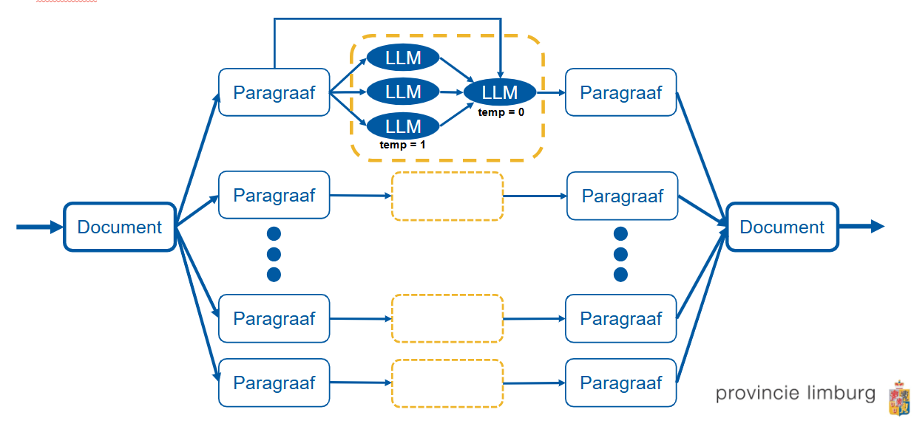

# B1-Taalniveau App

De **B1-Taalniveau App** is ontwikkeld om complexe teksten automatisch om te zetten naar begrijpelijke taal op **B1-niveau**, waardoor overheidsdocumenten toegankelijker worden voor een breed publiek. Het gebruik van een eigen algoritme is noodzakelijk om de beperkingen van standaardtaalmodellen te overkomen.  

Taalmodellen hebben beperkingen, zoals de maximale lengte van de outputtekst (output tokens). Hierdoor is het noodzakelijk om documenten op te splitsen in kleinere onderdelen, zoals paragrafen. Dit garandeert dat de volledige inputtekst nauwkeurig kan worden verwerkt en teruggezet in B1-taalniveau. Daarnaast zorgt het genereren van meerdere tekstvarianten per paragraaf, voordat een definitieve versie wordt vastgesteld, voor een hogere kwaliteit en consistentie in de uitkomst.

De B1-Taalniveau App levert hiermee kwalitatief hoogwaardige en consistente vereenvoudigde teksten in een eenvoudig te gebruiken gebruikersinterface.

---

## Uitleg van het Algoritme

Het onderstaande schema illustreert de werking van de B1-Taalniveau App:

1. **Input**: Een document wordt geüpload in de app als invoer.
2. **Opdeling in paragrafen**: Het document wordt opgesplitst in kleinere tekstonderdelen. Dit voorkomt dat de beperkingen van de taalmodellen invloed hebben op de verwerking en versnelt het proces.
3. **Vereenvoudiging per paragraaf**:
   - Elk onderdeel wordt afzonderlijk verwerkt door meerdere LLM's (standaardinstelling = 3), waarbij de "temperatuur"-parameter van de modellen wordt aangepast (bijvoorbeeld temperatuur = 1). Dit resulteert in **meerdere vereenvoudigde tekstvarianten** per paragraaf.
   - De gegenereerde tekstvarianten worden geëvalueerd, waarbij ook de oorspronkelijke paragraaf als referentie wordt gebruikt. Dit leidt tot een gecombineerde, optimale vereenvoudiging.
4. **Samenvoeging van vereenvoudigde tekst**: De definitief gekozen paragrafen worden samengevoegd tot één coherent document.
5. **Output**: Het resultaat is een document in begrijpelijke taal dat voldoet aan de normen van B1-taalniveau voor overheidscommunicatie.
---

## Status van het Project

De implementatie van de B1-Taalniveau App binnen de **Provincie Limburg** is momenteel in volle gang. Het algoritme wordt getest en geïntegreerd in het **App Launcher-platform** van GovChat-NL. We verwachten dat de app in de komende maanden beschikbaar wordt gesteld voor gebruik door ambtenaren en andere overheidsinstanties.
