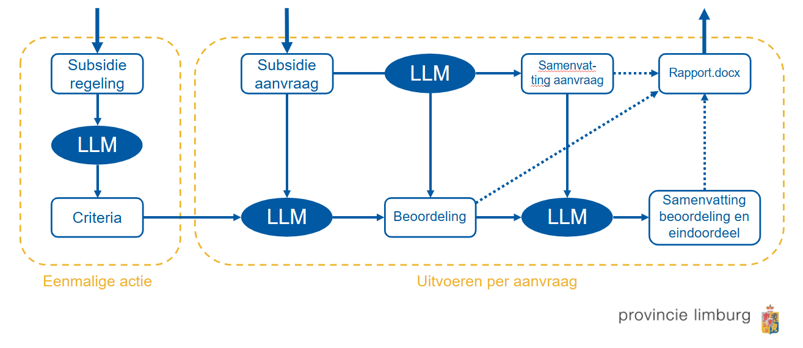

# SubsidieBeoordeling App

De **SubsidieBeoordeling App** is een geavanceerde tool die helpt bij het verwerken en beoordelen van subsidieaanvragen. Door gebruik te maken van **Large Language Models (LLM's)** automatiseert deze applicatie een groot deel van het beoordelingsproces, waardoor zowel de snelheid als de consistentie van beoordelingen wordt verbeterd. 

Het algoritme is speciaal ontworpen om de benodigde stappen sequentieel uit te voeren met behulp van LLM's, waardoor een reproduceerbaar proces wordt gegarandeerd. Tegelijkertijd biedt de app een gebruiksvriendelijke interface die aansluit op de werkwijze van de subsidieverlener. Het algoritme kan beoordelingscriteria automatisch extraheren uit subsidievoorwaarden, individuele aanvragen beoordelen en overzichtelijke rapportages genereren. Door het beoordelingsproces op te delen in duidelijke en gestructureerde stappen, ontstaat een overzichtelijke procedure die de subsidieverlener helder inzicht biedt in de totstandkoming van het oordeel.

---

## Uitleg van het Algoritme

Het onderstaande schema illustreert de werking van de SubsidieBeoordeling App:

### 1. Eenmalige actie: Opstellen van beoordelingcriteria
   - **Input**: De **subsidievoorwaarden** worden ingevoerd in de app.
   - **Extractie van criteria**: Met behulp van een LLM worden de relevante beoordelingscriteria automatisch geëxtraheerd uit de subsidievoorwaarden.
   - **Output**: Een overzicht van concrete en consistent beschreven criteria die gebruikt worden bij het beoordelen van aanvragen.

### 2. Uitvoeren per aanvraag: Subsidiebeoordelingsproces
   1. **Invoer subsidieaanvraag**:  
      De gebruiker uploadt een subsidieaanvraag in de app.
   2. **Samenvatting van de aanvraag**:  
      Een LLM genereert een beknopte en gestructureerde samenvatting van de aanvraag, waarin de belangrijkste informatie wordt uitgelicht.
   3. **Beoordeling van de aanvraag**:  
      - De samenvatting van de aanvraag wordt vergeleken met de eerder vastgestelde beoordelingscriteria.
      - Een LLM voert een beoordeling uit en wijst scores toe aan de verschillende criteria. Eventuele opmerkingen of nuances worden toegevoegd. 
   4. **Rapportgeneratie**:  
      - Op basis van de beoordeling wordt een duidelijk rapport (.docx-bestand) gegenereerd, inclusief een samenvatting van de beoordeling en een voorlopig eindoordeel. 
      - Het rapport kan direct gebruikt worden ter ondersteuning van besluitvorming of communicatie met de aanvrager.

---

## Status van het Project

De ontwikkeling van de **SubsidieBeoordeling App** is momenteel in uitvoering binnen de **Provincie Limburg**. De app wordt getest op praktische toepasbaarheid en gebruiksgemak en geïntegreerd in het **App Launcher-platform** van GovChat-NL. Naar verwachting zal de app in de komende maanden beschikbaar komen voor gebruik door ambtelijke diensten en andere betrokken overheidsorganisaties.
