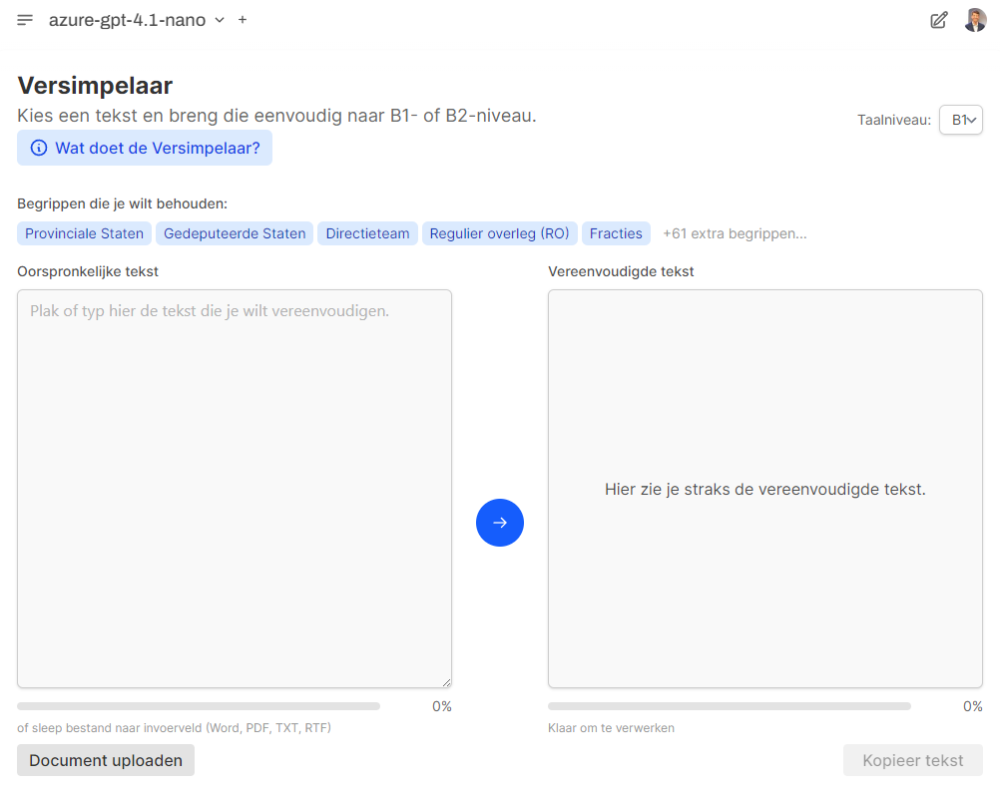
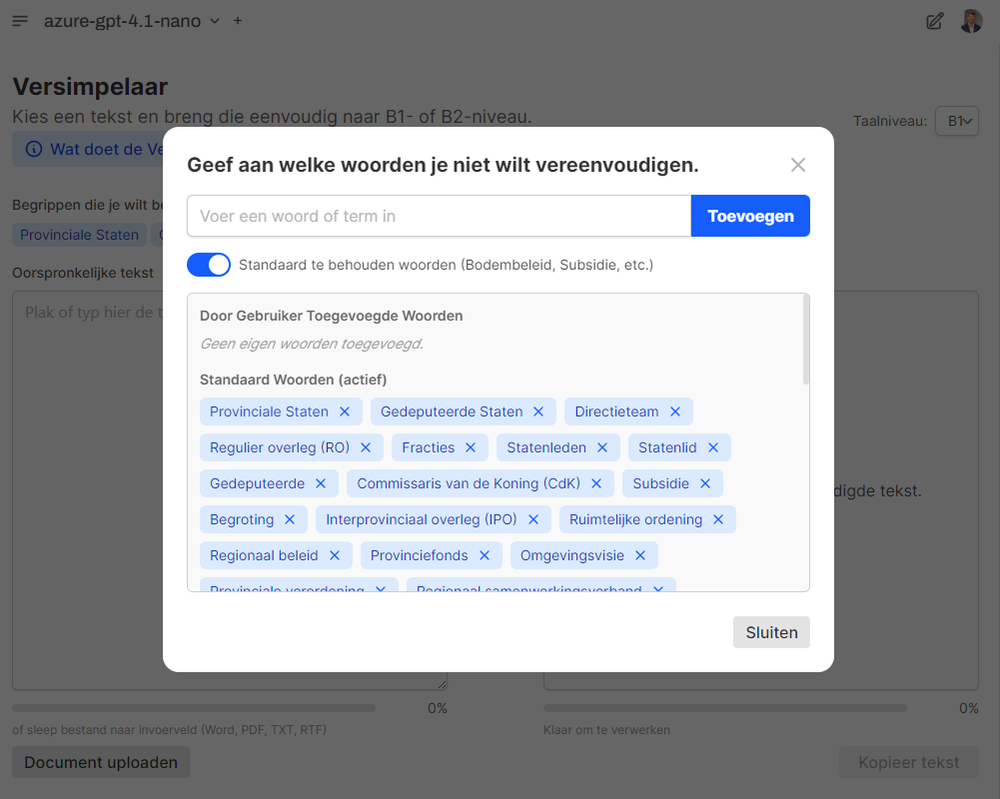
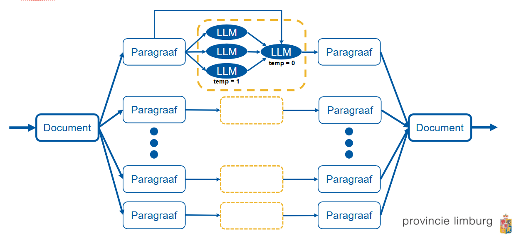

   # Versimpelaar

   De **Versimpelaar** maakt overheidscommunicatie toegankelijker door complexe teksten automatisch om te zetten naar begrijpelijke taal op **B1- of B2-niveau**. Hiermee wordt het lezen van overheidsdocumenten eenvoudiger, zodat een breed publiek deze kan begrijpen. De applicatie is via het GovChat-NL platform beschikbaar voor ambtenaren en andere overheidsorganisaties.

   

   > In de applicatie vind je een knop "Wat doet de Versimpelaar?" waarmee je uitleg krijgt over de werking van de app en het gebruik van AI. Deze toelichting is toegevoegd in het kader van de vereiste AI-geletterdheid vanuit de AI-verordening.

   ---

   ## Wat doet de Versimpelaar?

   De Versimpelaar helpt je om snel en betrouwbaar teksten te vereenvoudigen naar het gewenste taalniveau (B1 of B2). Daarbij houdt de app rekening met begrippen die niet vereenvoudigd mogen worden, zoals specifieke provinciale termen. Het doel is dat overheidscommunicatie voor zoveel mogelijk inwoners direct begrijpelijk is.

   **Wat is B1-taalniveau?**
   - Eenvoudige, veelvoorkomende woorden
   - Korte zinnen (15–20 woorden per zin)
   - Geen ingewikkelde zinsconstructies of vakjargon
   - Concreet, duidelijk en direct  

   B1-niveau is geschikt voor het grootste deel van de volwassen bevolking in Nederland.

   **Wat is B2-taalniveau?**
   - Ietwat complexere, minder alledaagse woorden en begrippen  
   - Afwisselende, soms langere zinnen (meestal tot 25 woorden)  
   - Meer gebruik van verbindende woorden (zoals ‘hoewel’, ‘desondanks’)  
   - Enigszins complexe zinsconstructies zijn mogelijk, maar de tekst blijft helder en logisch opgebouwd  

   B2-niveau is bedoeld voor mensen die zelfstandig en vlot complexe teksten kunnen begrijpen, bijvoorbeeld mensen met een goede beheersing van het Nederlands of met een hogere opleiding.  

   B2 is als keuzemogelijkheid toegevoegd omdat de ervaring leert dat B1 soms té eenvoudig is, waardoor nuances of details uit de boodschap verloren kunnen gaan. Met B2 blijft de tekst toegankelijk, maar is er meer ruimte voor nuance.

   ---

   ## Hoe werkt de Versimpelaar?

   1. **Voer een tekst in**  
      Plak de tekst die je wilt vereenvoudigen in het linkervak, of upload een document (Word, PDF, TXT, RTF).

   2. **Kies te behouden begrippen (optioneel)**  
      Selecteer woorden of termen die niet vereenvoudigd mogen worden, zoals ambtelijke of provinciespecifieke begrippen. De app bevat standaardlijsten die je kunt aanvullen of aanpassen.

      

   3. **Start de verwerking**  
      Klik op de pijl om de tekst te laten vereenvoudigen. Je ziet de voortgang onderaan het scherm.

   4. **Bekijk de vereenvoudigde tekst**  
      In het rechtervak verschijnt de tekst op gekozen B1- of B2-niveau, klaar om te kopiëren en verder te gebruiken.

   > **Let op:** De Versimpelaar is een hulpmiddel. Controleer altijd het resultaat en pas dit waar nodig aan.

   ---

   ## Uitleg algoritme

   De Versimpelaar gebruikt een algoritme om teksten van willekeurige lengte op te splitsen in paragrafen. Elk tekstdeel wordt vervolgens verwerkt door meerdere taalmodellen (n=3), elk met een hoge temperatuurinstelling (temperature = 1). Hierdoor ontstaan per paragraaf verschillende vereenvoudigde versies.

   De applicatie selecteert en combineert automatisch de beste resultaten, altijd in combinatie met de originele paragraaf. Op deze manier wordt de oorspronkelijke boodschap zoveel mogelijk geborgd in de vereenvoudigde versie en blijft de uiteindelijke tekst begrijpelijk én consistent.

   Stroomschema van het algoritme:
   

   ---

   ## Status & implementatie

   De Versimpelaar is **gereed** en inmiddels geïntegreerd in het App Launcher-platform van GovChat-NL. De applicatie wordt momenteel binnen de **Provincie Limburg** gebruikt. Ook andere overheden kunnen gebruikmaken van de Versimpelaar.
      
   ---

   ## Versimpelaar App-Launcher configuratie

   De Versimpelaar heeft eigen configuratie-opties die via environment-variabelen kunnen worden ingesteld.

   ### `versimpelaar_MAX_INPUT_WORDS` (Default: `24750`)
   Deze variabele bepaalt het maximale aantal woorden dat kan worden ingevoerd in de Versimpelaar voor tekstverwerking. De limiet is ingesteld om optimale verwerkingsprestaties te garanderen en serverbelasting te beheersen.

   Wanneer een gebruiker een tekst invoert die langer is dan deze limiet, krijgt deze een foutmelding en wordt de tekst niet verwerkt. De standaardwaarde van 24.750 woorden biedt ruimte voor aanzienlijk lange documenten, zoals beleidsnotities of rapporten.

   ### `versimpelaar_MAX_CHUNK_TOKENS` (Default: `1200`)
   Deze variabele regelt de maximale grootte van tekstblokken (chunks) waarin lange teksten worden opgesplitst tijdens de vereenvoudigingsverwerking. Elke chunk wordt afzonderlijk naar het AI-model gestuurd voor verwerking.

   Een kleinere chunk-grootte zorgt voor snellere verwerking per stuk, maar verhoogt het totale aantal verwerkingsstappen. Een grotere chunk-grootte kan efficiënter zijn voor lange teksten, maar vraagt meer verwerkingskracht per stap. De standaardwaarde van 1.200 tokens biedt een goede balans tussen verwerkingssnelheid en kwaliteit.

   Voorbeeldinstelling:
   ```plaintext
   versimpelaar_MAX_CHUNK_TOKENS=1500
   ```

   ### `versimpelaar_DEFAULT_PRESERVED_WORDS` (Default: JSON array met standaardtermen)
   Deze variabele bevat een JSON-array met standaardwoorden en -termen die tijdens de tekstvereenvoudiging behouden moeten blijven. Deze woorden worden niet vereenvoudigd en blijven in hun originele vorm staan, ook al zijn ze complex voor het B1-taalniveau.

   De standaardlijst bevat typische overheidstermen zoals 'Provinciale Staten', 'Gedeputeerde Staten', 'Commissaris van de Koning', 'Subsidie', 'Begroting', enzovoort. Organisaties kunnen deze lijst aanpassen naar hun specifieke terminologie.

   Voorbeeldinstelling:
   ```plaintext
   versimpelaar_DEFAULT_PRESERVED_WORDS=["Provinciale Staten","Gemeenteraad","Burgemeester","Wethouder","Subsidie","Begroting","Verordening"]
   ```
