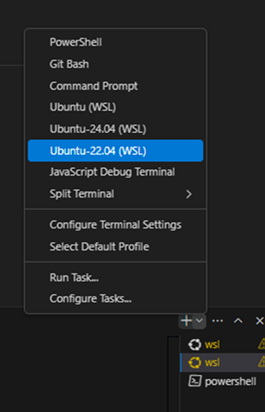
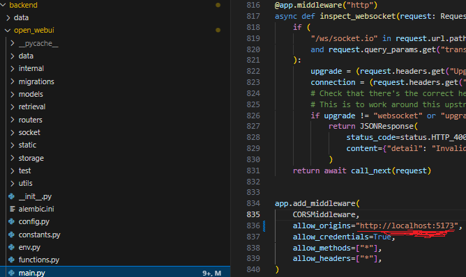

# GovChat-NL
Welkom bij de **GovChat-NL Ontwikkel Handleiding**!  
In deze handleiding leggen we stap voor stap uit hoe je een ontwikkelomgeving opzet voor GovChat-NL.

Let op: Hoewel deze handleiding specifiek Azure API gebruikt als voorbeeld, kun je eenvoudig overschakelen naar andere providers zoals Ollama, afhankelijk van je voorkeur of vereisten.

---

## 📥 Initiele Installatie

### **0. Visual Studio Code met WSL-extensie**
- Gebruik **Visual Studio Code (VS Code)** om de code te bewerken.
- Installeer de **"Remote Development"**-extensie en het **"WSL" Expansion Pack**.
  Hiermee kun je WSL-projecten direct openen binnen VS Code.

---

### **1. Installatie van WSL (Windows Subsystem for Linux)**  
1. Open **PowerShell** als Administrator.  
2. Voer het volgende commando uit om WSL2 te activeren:

    ```bash
    wsl --install
    ```

   Dit installeert **WSL2** en downloadt automatisch **Ubuntu** (als je nog geen Linux-distributie hebt).  
3. Herstart je computer als dat gevraagd wordt.  
4. Controleer of WSL correct geïnstalleerd is:

    ```bash
    wsl --list --verbose
    ```

   Dit toont een lijst van geïnstalleerde distributies en hun versie. Zorg ervoor dat **WSL2** is ingesteld.

---

### **2. Configuratie van de Linux-omgeving**  
1. Start je WSL-distributie (bijvoorbeeld Ubuntu) via het Startmenu óf typ in PowerShell/CMD:

    ```bash
    wsl
    ```

2. Werk de pakketlijst bij en installeer updates:

    ```bash
    sudo apt update && sudo apt upgrade -y
    ```

---

### **3. Installatie van Python**  
- Controleer of **Python 3.11+** is geïnstalleerd:

    ```bash
    python3 --version
    ```

- Als Python niet aanwezig of verouderd is, installeer het dan:

    ```bash
    sudo apt install python3 python3-pip -y
    ```

---

### **4. Installatie van Conda**  
**Miniconda** is aanbevolen vanwege de compactere installatie.  
1. Download het installatiebestand:

    ```bash
    wget https://repo.anaconda.com/miniconda/Miniconda3-latest-Linux-x86_64.sh
    ```

2. Voer het installatiebestand uit en volg de instructies. Vergeet niet de licentie te accepteren en de standaardpaden in te stellen.  
3. Herstart de shell:

    ```bash
    source ~/.bashrc
    ```

4. Controleer of **Conda** correct is geïnstalleerd:

    ```bash
    conda --version
    ```

---


## 🚀 Quickstart

### **1. WSL openen in VS Code**
1. Open twee WSL-terminals in VS Code:
   
2. Als het project niet zichtbaar is, start WSL normaal op en typ:

    ```bash
    ls
    ```

3. Clone vervolgens het **GovChat-NL** project:

    ```bash
    git clone https://github.com/jeannotdamoiseaux/GovChat-NL.git
    cd GovChat-NL
    ```

---

### **2. Frontend Setup (eerste terminal)**  
1. Maak een **.env** bestand aan door het voorbeeldbestand te kopiëren:

    ```bash
    cp -RPp .env.example .env
    ```

2. Open het gegenereerde bestand en pas de LiteLLM-key aan.  
3. Installeer dependencies:

    ```bash
    npm install
    ```

4. Start de frontend:

    ```bash
    npm run dev
    ```

---

### **3. Backend Setup (tweede terminal)**  
1. Navigeer naar de backend-folder:

    ```bash
    cd GovChat-NL/backend
    ```

2. Maak een virtuele Conda-omgeving aan:

    ```bash
    conda create --name GovChat-NL python=3.11
    ```

3. Activeer de Conda-omgeving:

    ```bash
    conda activate GovChat-NL
    ```

4. Installeer backend-pakketten:

    ```bash
    pip install -r requirements.txt -U
    ```

5. Start de backend:

    ```bash
    sh dev.sh
    ```

---

### **4. Admin inlog**  
- **Gebruikersnaam:** `root`  
- **E-mail:** `root@toor.nl`  
- **Wachtwoord:** `toor`  

---

## ⚙️ Troubleshooting

### **Error Backend Required**
| Error | Beschrijving                                                                                     |
|-------|-------------------------------------------------------------------------------------------------|
|  | Dit geeft aan dat "CORS_ALLOW_ORIGIN" niet lokaal is ingesteld. Pas dit aan naar "localhost". |

---

## 🤖 Lite LLM API Connectie

Let op: Hoewel deze handleiding specifiek Azure API gebruikt als voorbeeld, kun je eenvoudig overschakelen naar andere providers zoals Ollama, afhankelijk van je voorkeur of vereisten.

### **1. Docker installeren**
Download en installeer **Docker** via:  
[Officiële Docker Download](https://www.docker.com/)

### **2. Configureer credentials**
Update de volgende bestanden:  
- **.env**  
- **litellm/litellm_config.yaml**

### **3. Run Docker-services**
- Klik op **"Run all services"** in het bestand `docker-compose-lite-llm-local.yaml` binnen VS Code.  
- Als Docker al eerder is gebruikt, start de image opnieuw binnen de Docker-app.